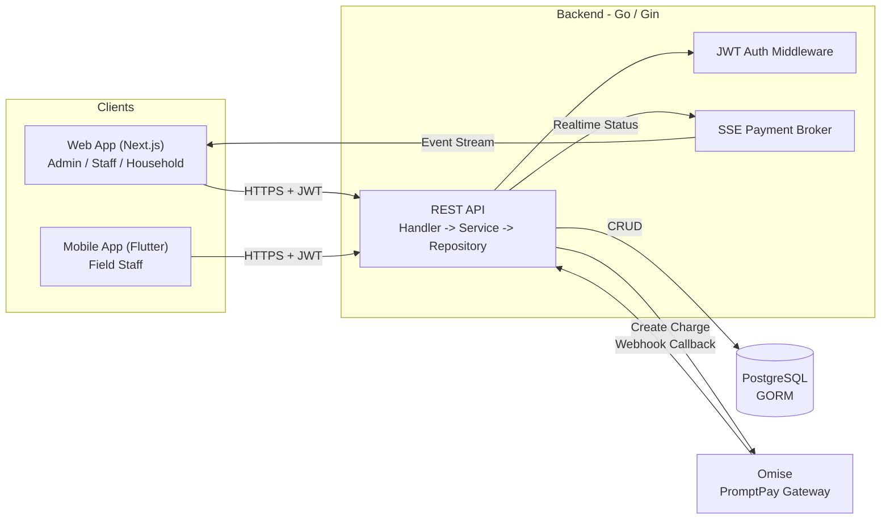

# Water & Garbage Billing System

ระบบจัดเก็บค่าน้ำประปาและค่าขยะสำหรับองค์การบริหารส่วนตำบล (อบต.) / เทศบาล ที่ช่วยแปลงกระบวนการจดมิเตอร์ คำนวณค่าใช้จ่าย ออกใบแจ้งหนี้ และรับชำระเงินของครัวเรือน จากการทำงานด้วยกระดาษและตารางคำนวณแยกส่วน ให้กลายเป็น Workflow เดียวที่เชื่อมต่อกันแบบ End-to-End ตั้งแต่พนักงานภาคสนามจนถึงฝ่ายบริหาร ระบบพัฒนาขึ้นเป็นโครงงานจบระดับมหาวิทยาลัย (Capstone Project) โดยทีมพัฒนา 4 คน มีกลุ่มผู้ใช้งานหลักคือเจ้าหน้าที่ อบต./เทศบาล (Admin, Staff สำนักงาน, Staff ภาคสนาม) และประชาชนในพื้นที่ (ครัวเรือน) เป้าหมายของระบบคือลดความผิดพลาดจากการคำนวณด้วยมือ ลดเวลาในการออกบิลและติดตามหนี้ค้างชำระ และเปิดช่องทางชำระเงินที่หลากหลายขึ้นทั้งเงินสดและ QR PromptPay

---

## Business Context

ก่อนมีระบบนี้ อบต./เทศบาลขนาดเล็กส่วนใหญ่จดบันทึกมิเตอร์น้ำและปริมาณขยะของแต่ละครัวเรือนด้วยกระดาษ แล้วนำมาคำนวณค่าใช้จ่ายและออกใบแจ้งหนี้แบบแยกกันในโปรแกรมสำนักงานทั่วไป ทำให้เกิดปัญหาหลายด้าน เช่น ตัวเลขมิเตอร์คลาดเคลื่อนหรือคำนวณอัตราก้าวหน้าผิดพลาด ไม่มีที่มาการคำนวณให้ตรวจสอบย้อนหลังได้ การติดตามว่าครัวเรือนใดค้างชำระทำได้ยากเพราะข้อมูลกระจัดกระจาย และเมื่อมีการปรับอัตราค่าน้ำใหม่ ใบแจ้งหนี้ของเดือนก่อนหน้าอาจถูกกระทบโดยไม่ได้ตั้งใจหากไม่มีการเก็บประวัติราคาแยกไว้

ระบบใหม่แก้ปัญหาดังกล่าวโดยรวมข้อมูลครัวเรือน การจดมิเตอร์ การคำนวณค่าน้ำแบบขั้นบันได (Progressive Rate) และการออกใบแจ้งหนี้ไว้ในฐานข้อมูลเดียว พร้อมเก็บ Snapshot ของอัตราค่าน้ำที่ใช้จริงในแต่ละเดือนไว้เป็นประวัติ เพื่อให้ใบแจ้งหนี้เก่าไม่เปลี่ยนแปลงแม้จะมีการปรับอัตราใหม่ในอนาคต นอกจากนี้ยังเพิ่มช่องทางชำระเงินผ่าน QR PromptPay ควบคู่กับการรับเงินสดหน้างานโดยพนักงานภาคสนาม เพื่อให้ประชาชนสะดวกขึ้นและฝ่ายบริหารเห็นภาพรวมรายรับ-รายจ่ายผ่าน Dashboard ได้ทันที

---

## Project Overview

ระบบประกอบด้วย 3 ส่วนหลักที่ทำงานร่วมกันผ่าน REST API ชุดเดียว

- **Web Application** (Next.js) สำหรับผู้ดูแลระบบ ใช้จัดการข้อมูลองค์กร ตำบล/หมู่บ้าน/ครัวเรือน ตั้งอัตราค่าน้ำ-ค่าขยะ ดูแดชบอร์ด และออกรายงาน รวมถึงมีส่วนสำหรับครัวเรือนเข้าดูและชำระบิลของตนเอง
- **Mobile Application** (Flutter) สำหรับพนักงานภาคสนาม ใช้จดมิเตอร์น้ำและบันทึกปริมาณขยะที่หน้าบ้าน รับชำระเงินสด และพิมพ์ใบเสร็จ
- **Backend** (Go REST API) ทำหน้าที่เป็นศูนย์กลางของ Business Logic ทั้งหมด ตั้งแต่การคำนวณค่าน้ำแบบขั้นบันได การรวมยอดค่าน้ำ-ขยะเป็นใบแจ้งหนี้ การยืนยันตัวตนด้วย JWT การเชื่อมต่อ Payment Gateway (Omise PromptPay) และ Webhook ยืนยันการชำระเงิน
- **Database** ใช้ PostgreSQL เก็บข้อมูลทั้งหมดผ่าน GORM โดยออกแบบให้มีลำดับชั้นทางภูมิศาสตร์ (จังหวัด → อำเภอ → ตำบล → หมู่บ้าน → ครัวเรือน) และแยกตารางประวัติราคาออกจากตารางอัตราปัจจุบันอย่างชัดเจน

แต่ละ Role มีหน้าที่ต่างกัน: **Super Admin** ดูแลข้อมูลองค์กร (อบต.) ในระดับสูงสุด, **Admin** จัดการผู้ใช้งานและตั้งค่าตำบลทั้งหมด, **Staff สำนักงาน** ดูแดชบอร์ด จัดการหมู่บ้าน/ครัวเรือน และตรวจสอบการชำระเงิน, **Staff ภาคสนาม** ใช้แอปมือถือจดมิเตอร์และรับเงินหน้างาน, และ **ครัวเรือน (Household)** เข้าดูใบแจ้งหนี้และชำระเงินผ่านหน้าเว็บของตนเอง

---

## Key Features

- **Household Management** – จัดการข้อมูลครัวเรือน พร้อมนำเข้าข้อมูลจำนวนมากผ่านไฟล์ CSV/Excel แบบตรวจสอบความถูกต้องทั้งไฟล์ก่อนบันทึก
- **Water Meter Reading** – บันทึกเลขมิเตอร์น้ำรายเดือน พร้อมคำนวณค่าน้ำอัตโนมัติตามอัตราก้าวหน้า (Progressive Rate)
- **Garbage Collection Billing** – บันทึกจำนวนถังขยะตามขนาดที่จัดเก็บ และคำนวณค่าบริการตามอัตราที่ตั้งไว้ต่อตำบล
- **Monthly Invoice Generation** – รวมยอดค่าน้ำและค่าขยะของครัวเรือนในแต่ละเดือนเป็นใบแจ้งหนี้เดียวโดยอัตโนมัติ
- **QR PromptPay Payment** – ออก QR Code ชำระเงินผ่าน Omise และยืนยันสถานะแบบเรียลไทม์ผ่าน Server-Sent Events (SSE)
- **Cash Payment** – รับชำระเงินสดหน้างานโดยพนักงาน พร้อมออกเลขที่ใบเสร็จ
- **Billing Cycle & Historical Pricing** – เก็บ Snapshot อัตราค่าน้ำของแต่ละเดือนแยกจากอัตราปัจจุบัน เพื่อรักษาความถูกต้องของใบแจ้งหนี้ย้อนหลัง
- **Reporting Dashboard** – สรุปจำนวนครัวเรือน สถานะใบแจ้งหนี้ (ค้างชำระ/ชำระแล้ว/เกินกำหนด) และรายรับตามช่วงเวลา/หมู่บ้าน
- **User & Role Management** – จัดการบัญชีผู้ใช้งานตามลำดับสิทธิ์ (Super Admin, Admin, Staff, Field Staff, Household)
- **Historical Billing Data** – ดูประวัติการจดมิเตอร์ ใบแจ้งหนี้ และใบเสร็จของครัวเรือนแต่ละราย

---

## System Architecture

ระบบใช้สถาปัตยกรรมแบบ Client-Server โดยมี Backend เป็น REST API กลางที่ทั้ง Web และ Mobile เรียกใช้งานร่วมกัน แยก Business Logic ทั้งหมดไว้ที่ฝั่ง Backend เพื่อให้ทั้งสอง Client ไม่ต้องคำนวณซ้ำและข้อมูลตรงกันเสมอ



- **Frontend (Next.js)**: เรียก Backend ผ่าน HTTP ด้วย Fetch wrapper ที่แนบ JWT อัตโนมัติ และใช้ Middleware ตรวจ Role จาก Cookie เพื่อกำหนดสิทธิ์การเข้าถึงแต่ละหน้า
- **Mobile (Flutter)**: ใช้แนวทาง Clean Architecture (Domain / Data / Presentation) เรียก API ชุดเดียวกันภายใต้ Endpoint กลุ่ม `/api/mobile/*` และเก็บ Token ไว้แบบปลอดภัยในเครื่อง
- **Backend (Go + Gin)**: จัดวางแต่ละโมดูลตามลำดับ Handler → Service → Repository → Entity ประกอบร่างด้วย Dependency Injection แบบ Manual ใน Container เดียว
- **Database (PostgreSQL)**: เข้าถึงผ่าน GORM ทุก Entity ใช้ Soft Delete และมีความสัมพันธ์เชิงลำดับชั้นตามพื้นที่การปกครอง
- **Authentication**: ใช้ JWT ที่ฝัง `user_id`, `subdistrict_id`, และ `role` ไว้ใน Claims ทำให้ทุก Query กรองข้อมูลตามตำบลของผู้ใช้งานได้โดยอัตโนมัติ (Multi-tenant ระดับตำบล)
- **External Service**: เชื่อมต่อ Omise สำหรับสร้าง QR PromptPay และตรวจสอบ Signature ของ Webhook ก่อนอัปเดตสถานะการชำระเงิน

---

## Technology Stack

| Layer | Technology |
|-------|------------|
| Frontend | Next.js 16 (App Router), React 19, TypeScript, Tailwind CSS v4 |
| Mobile | Flutter, Dart, Clean Architecture, ChangeNotifier |
| Backend | Go, Gin Web Framework |
| Database | PostgreSQL |
| ORM | GORM (gorm.io/gorm) + pgx driver |
| Authentication | JWT (golang-jwt/jwt/v5), bcrypt |
| Payment Gateway | Omise (PromptPay QR) |
| Real-time | Server-Sent Events (SSE) |
| File Import | Excelize (นำเข้าข้อมูลครัวเรือนจาก CSV/Excel) |
| DevOps | Docker, Docker Compose (Postgres, Backend, Frontend, Adminer) |

---

## Database Design

ฐานข้อมูลออกแบบบน PostgreSQL ผ่าน GORM โดยมีแนวคิดหลักดังนี้

**โครงสร้างลำดับชั้นของข้อมูล** ข้อมูลจัดเรียงเป็นลำดับชั้น `Province → District → Subdistrict → Village → HouseHold` ทำให้สามารถกรองและรายงานข้อมูลได้ในทุกระดับ ตั้งแต่ภาพรวมของตำบลลงไปถึงครัวเรือนรายบุคคล และรองรับการขยายไปดูแลหลายตำบลในอนาคตได้โดยไม่ต้องปรับโครงสร้างใหม่

**Referential Integrity ด้วย Foreign Key** ทุกความสัมพันธ์ระหว่างตาราง เช่น ครัวเรือนกับหมู่บ้าน หรือใบแจ้งหนี้กับการจดมิเตอร์ ผูกด้วย Foreign Key ที่ระดับฐานข้อมูล เพื่อป้องกันข้อมูลกำพร้า (Orphan Record) และรับประกันว่าความสัมพันธ์ของข้อมูลถูกต้องเสมอ

**Soft Delete** ทุก Entity สืบทอดจาก `gorm.Model` ซึ่งมีคอลัมน์ `DeletedAt` ทำให้การลบข้อมูล เช่น หมู่บ้านหรืออัตราค่าบริการ เป็นการซ่อนข้อมูลแทนการลบจริง เพื่อรักษาความสมบูรณ์ของข้อมูลอ้างอิงในใบแจ้งหนี้และรายงานย้อนหลัง

**Pricing History (จุดที่ออกแบบละเอียดที่สุด)** อัตราค่าน้ำแบบขั้นบันได (`WaterUnit`) สามารถถูกปรับเปลี่ยนได้ตามช่วงเวลา แต่ใบแจ้งหนี้ที่ออกไปแล้วต้องไม่เปลี่ยนตามหากมีการปรับราคาใหม่ จึงแยกตาราง `WaterUnitHistory` ไว้เก็บ Snapshot ของอัตราที่ใช้จริงในแต่ละเดือน/ปีของแต่ละตำบลโดยเฉพาะ เมื่อมีการจดมิเตอร์ครั้งแรกของเดือนนั้น ระบบจะคัดลอกอัตราปัจจุบันไปแช่แข็งไว้ในตารางประวัติโดยอัตโนมัติ และใช้อัตรานั้นคำนวณตลอดทั้งเดือน

**Invoice เป็นศูนย์กลางของรอบบิล** ตาราง `Invoice` ผูกกับทั้ง `WaterReading` และ `GarbageReading` ของเดือนเดียวกัน แล้วรวมยอดเป็นค่าใช้จ่ายก้อนเดียวต่อครัวเรือนต่อเดือน แทนการแยกออกเป็นบิลย่อยสองใบ ช่วยลดความสับสนของผู้ใช้งานฝั่งครัวเรือน

**Transaction และสถานะการชำระเงิน** ตาราง `PaymentTransaction` แยกออกจาก `Invoice` เพื่อรองรับกรณีชำระเงินซ้ำหรือล้มเหลว โดยเก็บ `PaymentMethod` (เงินสด/QR PromptPay), `PaymentStatus`, `OmiseTransactionID`, และ `RawGatewayResponse` ไว้เป็นหลักฐานตรวจสอบ ทำให้ Invoice หนึ่งใบสามารถมีประวัติการพยายามชำระเงินได้หลายครั้งโดยไม่สูญข้อมูล

---

## Main Workflow

1. **Household Registration** – Admin/Staff ลงทะเบียนครัวเรือนใหม่ในระบบ (หรือนำเข้าเป็นกลุ่มผ่านไฟล์ Excel) ระบบจะสร้างบัญชีผู้ใช้งานให้ครัวเรือนโดยอัตโนมัติ
2. **Water Meter Reading** – พนักงานภาคสนามจดเลขมิเตอร์น้ำผ่านแอปมือถือ ระบบตรวจสอบว่าค่าไม่ต่ำกว่าครั้งก่อน แล้วคำนวณหน่วยที่ใช้จริงและค่าใช้จ่ายตามอัตราขั้นบันไดของตำบลนั้น
3. **Garbage Collection Recording** – พนักงานบันทึกจำนวนถังขยะตามขนาดที่จัดเก็บของครัวเรือน ระบบคำนวณค่าบริการตามอัตราที่ตั้งไว้
4. **Billing Cycle** – เมื่อมีการบันทึกมิเตอร์น้ำหรือขยะครั้งแรกในเดือนนั้น ระบบจะ Snapshot อัตราค่าน้ำปัจจุบันไปเก็บเป็นประวัติของเดือนนั้นโดยอัตโนมัติ
5. **Invoice Generation** – ระบบสร้างหรืออัปเดตใบแจ้งหนี้ของเดือนนั้นให้ครัวเรือนโดยรวมยอดค่าน้ำและค่าขยะเข้าด้วยกันทันทีที่มีการบันทึกข้อมูล
6. **Payment** – ครัวเรือนชำระเงินผ่าน QR PromptPay ที่หน้าเว็บ หรือชำระเงินสดกับพนักงานภาคสนาม ระบบยืนยันผลผ่าน Webhook (สำหรับ QR) และอัปเดตสถานะแบบเรียลไทม์ผ่าน SSE
7. **Reporting** – ฝ่ายบริหารดูสรุปยอดค้างชำระ ยอดชำระแล้ว และรายรับรายเดือนผ่าน Dashboard เพื่อติดตามผลการจัดเก็บของแต่ละหมู่บ้าน

---

## My Contributions

ในโครงงานนี้ ผมรับผิดชอบการพัฒนาฝั่ง **Backend เป็นหลัก** ได้แก่

- **Database Design** – ออกแบบโครงสร้างฐานข้อมูล PostgreSQL ทั้ง 17 ตาราง ตั้งแต่โครงสร้างลำดับชั้นของข้อมูล ครัวเรือน ไปจนถึงตารางประวัติราคาและธุรกรรมการชำระเงิน
- **Business Logic Design** – ออกแบบและพัฒนา Logic การคำนวณค่าน้ำแบบอัตราก้าวหน้า (Progressive Rate) และการรวมยอดค่าน้ำ-ขยะเป็นใบแจ้งหนี้อัตโนมัติ
- **Backend Development** – พัฒนา REST API ด้วย Go และ Gin ครอบคลุมทุกโมดูล (Household, Village, Water Unit, Garbage Rate, Reading, Invoice, Payment, User/Staff, Dashboard, Organization) ทั้งฝั่งเว็บและฝั่งมือถือ
- **Authentication & Authorization** – พัฒนาระบบยืนยันตัวตนด้วย JWT และควบคุมสิทธิ์การเข้าถึงตามลำดับ Role (Super Admin, Admin, Staff, Field Staff, Household)
- **Invoice Module** – พัฒนา Logic การสร้าง/อัปเดตใบแจ้งหนี้อัตโนมัติจากข้อมูลการจดมิเตอร์น้ำและขยะ
- **Payment Module** – เชื่อมต่อ Omise สำหรับสร้าง QR PromptPay, ตรวจสอบ Signature ของ Webhook, บันทึกการชำระเงินสดโดยพนักงาน และพัฒนา SSE สำหรับอัปเดตสถานะการชำระเงินแบบเรียลไทม์
- **Water Billing & Garbage Billing** – พัฒนาโมดูลจดมิเตอร์น้ำและบันทึกขยะ พร้อมตรวจสอบความถูกต้องของข้อมูลก่อนคำนวณ
- **Deployment** – จัดทำ Dockerfile แบบ Multi-stage Build สำหรับ Backend และ Docker Compose สำหรับรันร่วมกับ PostgreSQL, Frontend และ Adminer

---

## Team Contributions

โครงงานนี้พัฒนาโดยทีม 4 คน โดยสมาชิกอีก 3 คนรับผิดชอบส่วนต่าง ๆ ดังนี้

- **Next.js Frontend** – พัฒนาหน้าเว็บสำหรับ Admin/Staff และครัวเรือน เชื่อมต่อกับ Backend API พร้อมระบบ Routing ตาม Role
- **Flutter Mobile** – พัฒนาแอปมือถือสำหรับพนักงานภาคสนาม ใช้จดมิเตอร์ บันทึกขยะ และรับชำระเงินหน้างาน
- **UI/UX, Testing & Documentation** – ออกแบบหน้าตาและประสบการณ์การใช้งาน ทดสอบระบบ และจัดทำเอกสารประกอบโครงงาน

---

## Technical Highlights

- **Progressive/Tiered Pricing** – คำนวณค่าน้ำตามอัตราขั้นบันไดที่ปรับได้ต่อตำบล โดยไล่คิดหน่วยที่ใช้ผ่านแต่ละขั้นตามลำดับ
- **Historical Price Snapshot** – แยกอัตราปัจจุบันกับอัตราที่ใช้จริงในอดีตออกจากกัน เพื่อไม่ให้บิลเก่าเปลี่ยนแปลงเมื่อมีการปรับราคาใหม่
- **Invoice Merge Logic** – รวมยอดค่าน้ำและค่าขยะของเดือนเดียวกันเป็นใบแจ้งหนี้เดียวโดยอัตโนมัติ ไม่ว่าจะบันทึกข้อมูลใดก่อน
- **Role-Based Access Control** – จำกัดสิทธิ์การเข้าถึง API ตามลำดับ Role ผ่าน JWT Middleware และขอบเขตของตำบล (Subdistrict Scope)
- **Soft Delete** – ทุก Entity รองรับการลบแบบไม่ทำลายข้อมูลจริง เพื่อรักษาความสมบูรณ์ของข้อมูลอ้างอิง
- **RESTful API** – ออกแบบ Endpoint กว่า 50 เส้นทางแยกตามทรัพยากรและมีเอกสารประกอบการใช้งาน
- **QR PromptPay Payment** – เชื่อมต่อ Payment Gateway จริง (Omise) พร้อมตรวจสอบ Signature ของ Webhook ก่อนยืนยันการชำระเงิน
- **Real-time Update (SSE)** – อัปเดตสถานะการชำระเงินไปยังหน้าเว็บแบบเรียลไทม์ผ่าน Server-Sent Events โดยไม่ต้อง Polling
- **Bulk Data Import** – นำเข้าข้อมูลครัวเรือนจำนวนมากจาก Excel/CSV พร้อมตรวจสอบความถูกต้องทั้งไฟล์ก่อนบันทึก

---

## Project Structure

```
capstone-project/
├── Backend/                    # Go REST API (ความรับผิดชอบของผม)
│   ├── main.go                 # จุดเริ่มต้นของแอป: เชื่อมต่อ DB, Migrate, Seed, เริ่ม Server
│   ├── core/                   # Bootstrap: config, database connection, DI container
│   ├── entity/                 # GORM Models ของทั้ง 17 ตาราง (Household, Invoice, Payment, ...)
│   ├── entity_seed/            # ข้อมูลตัวอย่างสำหรับ Development/Demo
│   ├── controller/             # โมดูล API ฝั่งเว็บ (handler/service/repository/schema ต่อฟีเจอร์)
│   ├── mobile_controller/      # โมดูล API เฉพาะฝั่งแอปมือถือ (login, household list, invoice/receipt)
│   ├── middleware/             # JWT Auth และ CORS
│   ├── utils/                  # Hash password, สร้าง/ตรวจสอบ JWT
│   ├── router/                 # ลงทะเบียนเส้นทาง API และเอกสาร API
│   ├── test/                   # Unit test ระดับ Entity Validation
│   └── Dockerfile
│
├── Frontend/my-app/            # Next.js Web Application (ทีมงาน)
│   └── app/
│       ├── page/                # หน้าเว็บแยกตาม Role (admin/staff/household/super_admin)
│       ├── component/           # UI Component ที่ใช้ร่วมกัน
│       ├── service/              # เรียก Backend API
│       └── interface/            # TypeScript Types
│
├── Mobile/my_app/              # Flutter Mobile Application (ทีมงาน)
│   └── lib/
│       ├── features/            # โมดูลตาม Feature (auth, water_garbage_collection)
│       └── core/                 # Config, Network, Widget ที่ใช้ร่วมกัน
│
└── docker-compose.yml           # รวม Service: PostgreSQL, Backend, Frontend, Adminer
```

---

## Future Improvements

- **Notification** – แจ้งเตือนครัวเรือนเมื่อมีใบแจ้งหนี้ใหม่หรือใกล้ครบกำหนดชำระ ผ่าน LINE Notify หรือ SMS
- **Online Payment Gateway เพิ่มเติม** – รองรับช่องทางชำระเงินอื่น เช่น บัตรเครดิต หรือ Mobile Banking โดยตรง
- **Multi-Tenant Improvement** – ขยายรองรับหลายองค์กร (อบต./เทศบาลหลายแห่ง) บน Instance เดียวกันอย่างเต็มรูปแบบ
- **Audit Log** – บันทึกประวัติการแก้ไขข้อมูลสำคัญ เช่น การเปลี่ยนอัตราค่าบริการหรือการลบข้อมูลครัวเรือน
- **Dashboard Analytics** – เพิ่มการวิเคราะห์เชิงลึก เช่น แนวโน้มการใช้น้ำ หรือพยากรณ์รายรับ
- **CI/CD** – ตั้ง Pipeline สำหรับ Build, Test และ Deploy อัตโนมัติ
- **Monitoring** – เพิ่มระบบ Logging และ Monitoring สำหรับตรวจสุขภาพของ Backend ใน Production
- **Docker Deployment (Production-ready)** – ปรับ Docker Compose ปัจจุบันให้ไม่ Drop Schema/Seed ข้อมูลทุกครั้งที่รัน และแยก Configuration ระหว่าง Dev/Production อย่างชัดเจน

---

## License

This project is developed for academic purposes as part of a university capstone project.